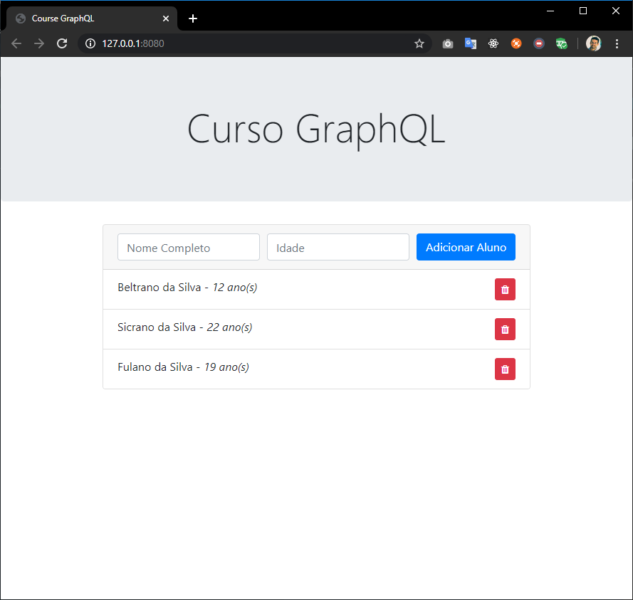

# book-exercises-graphql

Exercises of [GraphQL Book](https://www.casadocodigo.com.br/products/livro-graphql):



## Stack

- [Prisma](https://www.prisma.io/)
- [Node.js](https://nodejs.org)
- [GraphQL Yoga](https://github.com/prisma-labs/graphql-yoga)
- [Nodemon](https://nodemon.io/)
- [Bootstrap](https://getbootstrap.com/)
- [Http-server](https://github.com/http-party/http-server)

## Service

### graphql-prisma

> Online backend service

1. Install and init new prisma project

    ```bash
    npm i -g prisma
    prisma init graphql-prisma
    ```

2. Choose _Demo server_
3. Changes _datamodel.prisma_ content with:

    ```graphql
    type Aluno {
    id: ID! @id
    nomeCompleto: String!
    idade: Int
    curso: Curso
    }

    type Curso {
    id: ID! @id
    disciplina: String!
    alunos: [Aluno!]!
    }
    ```

4. Deploy

    ```bash
    prisma deploy
    ```

### graphql-backend

> Local backend service

```bash
npm install
npm install -g nodemon
nodemon server.js
```

### graphql-frontend

> Frontend service

```bash
npm install http-server -g
http-server .\
```

#### Setup

- Uses online backend

  1. Get endpoint

      ```bash
      prisma info
      ```

  2. Set endpoint _scripts.js_

      ```javascript
      endpoint: 'https://eu1.prisma.sh/raul-pereira-29c5b0/graphql-prisma/dev',
      wsConnection: new WebSocket(
          'wss://eu1.prisma.sh/raul-pereira-29c5b0/graphql-prisma/dev',
          'graphql-subscriptions'
      ),
      ```

- Uses local backend

  1. Set endpoint _scripts.js_

      ```javascript
      endpoint: 'http://localhost:3000',
      wsConnection: new WebSocket(
          'wss://localhost:3000/graphql',
          'graphql-subscriptions'
      ),
      ```
